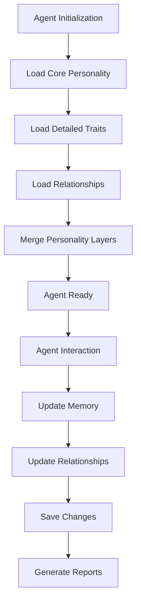

# 🏗️ Architecture Overview

## System Design Philosophy

The Agent Management System uses a **hybrid storage architecture** that combines the benefits of both relational databases and flexible JSON storage:

- **PostgreSQL**: Structured personality metadata, relationships, performance analytics
- **JSON Files**: Detailed traits, response patterns, learning history, contextual memories

## 🧠 Memory Architecture

### 4-Layer Memory System

```
┌─────────────────────────────────────────────────────────────┐
│                    Layer 4: Human Interface                 │
│              Natural Language Reports & Dashboards          │
├─────────────────────────────────────────────────────────────┤
│                    Layer 3: Relationship Network           │
│              PostgreSQL Agent Relationship Tracking        │
├─────────────────────────────────────────────────────────────┤
│                    Layer 2: Core Personality               │
│              PostgreSQL Structured Metadata                │
├─────────────────────────────────────────────────────────────┤
│                    Layer 1: Detailed Traits               │
│              JSON Flexible Personality Data                │
└─────────────────────────────────────────────────────────────┘
```

### Data Flow



## 🗄️ Database Schema Design

### Core Tables

#### agents
- **Purpose**: Central registry of all agents
- **Key Fields**: agent_id, agent_name, category, capabilities
- **Relationships**: Primary key for all personality data

#### agent_personalities
- **Purpose**: Core personality metadata
- **Key Fields**: personality_type, communication_style, authority_level
- **Design**: One-to-one with agents table

#### agent_relationships
- **Purpose**: Inter-agent relationship tracking
- **Key Fields**: agent_1_id, agent_2_id, relationship_type, strength_score
- **Design**: Many-to-many self-referencing

#### agent_memory_summaries
- **Purpose**: Daily memory summaries
- **Key Fields**: event_date, key_events, mood_indicator
- **Design**: One-to-many with agents

### Views for Human Readability

#### agent_personality_overview
- Joins agents + personalities for complete profile
- Human-readable personality summaries

#### agent_relationship_network
- Network view of all agent relationships
- Includes relationship strength indicators

#### agent_memory_human_readable
- Natural language memory summaries
- Mood indicators with emoji descriptions

## 📁 File System Architecture

### Directory Structure

```
AgentManagementPublic/
├── core/                     # Core system modules
│   ├── hybrid_personality_loader.py
│   └── [future modules]
├── agents/                   # Agent implementations
│   ├── base_agent.py
│   └── [specialized agents]
├── personalities/            # JSON personality files
│   ├── {agent_name}_personality.json
│   └── [personality definitions]
├── database/                 # Database schemas
│   ├── hybrid_personality_schema.sql
│   └── [migrations]
├── examples/                 # Usage examples
├── docs/                     # Documentation
├── tests/                    # Test suites
└── logs/                     # Agent activity logs
```

### JSON Personality Structure

```json
{
  "detailed_traits": {
    "trait_name": "numeric_value",
    "behavioral_parameters": {}
  },
  "response_patterns": {
    "situation_type": "template_with_{variables}",
    "message_templates": {}
  },
  "learning_history": [
    {
      "date": "timestamp",
      "event": "description",
      "insight": "learned_behavior",
      "confidence": "numeric_score"
    }
  ],
  "contextual_memories": [
    {
      "context": "situation_type",
      "memory": "contextual_learning",
      "frequency": "usage_count",
      "last_used": "timestamp"
    }
  ]
}
```

## 🔄 Personality Loading Process

### 1. Initialization Phase
```python
loader = HybridPersonalityLoader()
```
- Load database configuration
- Establish PostgreSQL connection
- Set JSON directory path

### 2. Core Personality Loading
```python
core_personality = loader.load_core_personality(agent_name)
```
- Query `agent_personality_overview` view
- Return structured personality metadata
- Handle missing data gracefully

### 3. Detailed Traits Loading
```python
detailed_personality = loader.load_detailed_personality(agent_name)
```
- Read JSON file from personalities directory
- Parse detailed traits and response patterns
- Create default structure if file missing

### 4. Relationship Loading
```python
relationships = loader.load_agent_relationships(agent_name)
```
- Query `agent_relationship_network` view
- Return all relationships involving the agent
- Include bidirectional relationships

### 5. Personality Merging
```python
complete_personality = loader.merge_personality_layers(core, detailed, relationships)
```
- Combine all personality layers
- Add metadata (loaded_at timestamp)
- Return unified personality structure

## ⚡ Performance Considerations

### Database Optimization

#### Indexes
- `idx_agents_name`: Fast agent lookups by name
- `idx_agent_personalities_type`: Personality type queries
- `idx_agent_relationships_agent1/agent2`: Relationship queries
- `idx_memory_summaries_agent_date`: Memory retrieval

#### Query Optimization
- Views pre-join related tables
- Minimal JOIN operations in application code
- Efficient relationship queries with proper indexing

### JSON File Performance
- Small file sizes (typically < 10KB per agent)
- In-memory caching of frequently accessed personalities
- Lazy loading of detailed traits when needed

### Memory Management
- Personality data cached per agent instance
- Memory summaries generated on-demand
- Relationship data shared across agent instances

## 🔒 Security Architecture

### Data Protection
- PostgreSQL ACID compliance
- Foreign key constraints prevent orphaned data
- Trigger-based timestamp updates

### Access Control
- Database user permissions
- File system access controls
- No sensitive data in JSON files

### Data Integrity
- Constraint validation in database
- JSON schema validation in application
- Transactional updates for consistency

## 🌐 Scalability Design

### Horizontal Scaling
- Database can be replicated
- JSON files can be distributed
- Agent instances are stateless

### Vertical Scaling
- PostgreSQL handles large agent populations
- Efficient indexing supports thousands of agents
- Memory usage scales linearly with active agents

### Network Distribution
- Personality data can be cached locally
- Database connections pooled
- JSON files can be CDN-distributed

## 🔮 Extension Points

### New Agent Types
- Extend `BaseAgent` class
- Add new personality JSON schemas
- Create specialized database views

### Custom Memory Systems
- Implement new memory summary formats
- Add custom relationship types
- Create domain-specific views

### Integration APIs
- REST API layer for web interfaces
- GraphQL endpoint for complex queries
- WebSocket support for real-time updates

This architecture provides a solid foundation for scalable, maintainable agent systems while preserving flexibility for future enhancements.